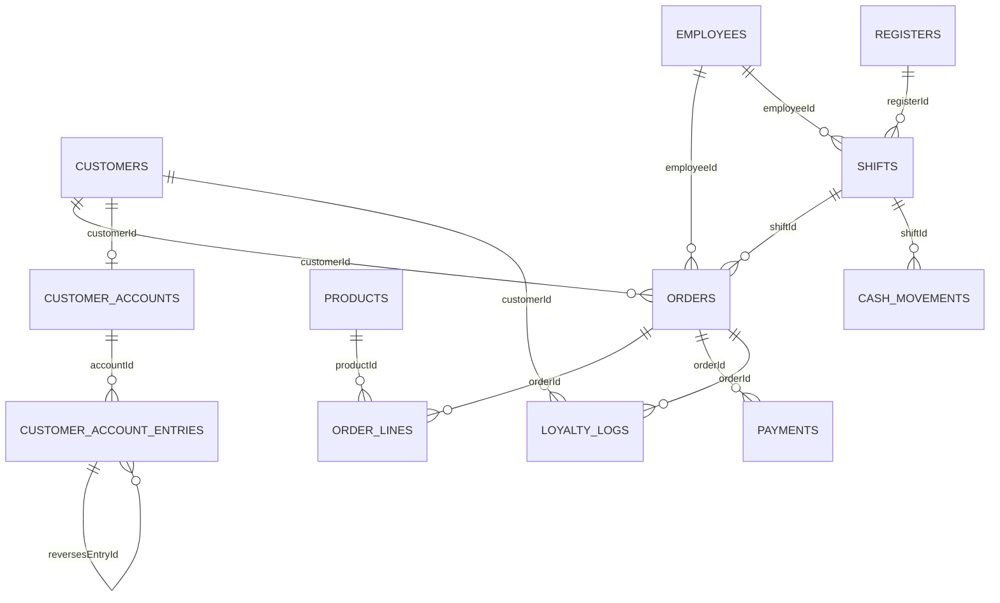
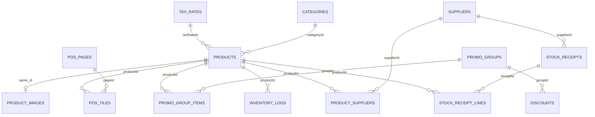

# L&Bj POS database schema

This document describes the complete current physical SQLite schema and the canonical schema used for new databases.

## Scope and sources

- Live SQLite database: `~/Library/Application Support/com.elamreda.tauri-app/pos.db`
- Canonical SQLite definition: `src/lib/stores/sqlite.ts`
- MariaDB mirror definition: `src/lib/stores/mysql.ts`
- Database filename configuration: `src/lib/stores/profile.ts`

The inspected database contains **41 physical tables**, **89 named indexes**, and **3 triggers**. This includes one FTS5 virtual table and five FTS5 shadow tables. The application catalogue below contains 35 ordinary tables plus the derived search structure.

## Storage conventions

- IDs are normally `TEXT` primary keys.
- Money is stored as integer pence in `INTEGER` columns.
- Boolean values use `INTEGER` values `0` and `1`.
- Timestamps are stored as ISO-style `TEXT` values.
- Most cross-table relationships are application-enforced ID links.
- `updatedAt` columns and indexes support delta synchronization.
- Orders, account entries and audit records keep snapshots so history remains understandable when master data changes.

## Relationship diagrams

### Sales, customers and tills

### Catalogue, promotions and stock

The diagrams show business relationships. The relationship matrix later in this document distinguishes live constraints from application-level links.

## Catalogue and POS layout

### `categories`

Product category master data.

| Column | Type | Constraints | Default |
|---|---|---|---|
| `id` | `TEXT` | PK | — |
| `name` | `TEXT` | NOT NULL | — |
| `color` | `TEXT` | — | — |
| `sortOrder` | `INTEGER` | — | `0` |
| `isActive` | `INTEGER` | — | `1` |
| `createdAt` | `TEXT` | — | — |
| `updatedAt` | `TEXT` | — | — |

### `tax_rates`

VAT and tax-rate definitions.

| Column | Type | Constraints | Default |
|---|---|---|---|
| `id` | `TEXT` | PK | — |
| `name` | `TEXT` | NOT NULL | — |
| `rate` | `REAL` | NOT NULL | — |
| `isDefault` | `INTEGER` | — | `0` |
| `createdAt` | `TEXT` | — | — |
| `updatedAt` | `TEXT` | — | — |

### `products`

Sellable product master, identifiers, prices, stock state and POS flags.

| Column | Type | Constraints | Default |
|---|---|---|---|
| `id` | `TEXT` | PK | — |
| `categoryId` | `TEXT` | — | — |
| `taxRateId` | `TEXT` | — | — |
| `name` | `TEXT` | NOT NULL | — |
| `sku` | `TEXT` | — | — |
| `barcode` | `TEXT` | — | — |
| `scalePlu` | `TEXT` | — | — |
| `price` | `INTEGER` | NOT NULL | — |
| `costPrice` | `INTEGER` | — | `0` |
| `stockLevel` | `INTEGER` | — | `0` |
| `trackStock` | `INTEGER` | — | `0` |
| `allowPriceOverride` | `INTEGER` | — | `0` |
| `isWeighable` | `INTEGER` | — | `0` |
| `showInGoods` | `INTEGER` | — | `0` |
| `goodsSortOrder` | `INTEGER` | — | `0` |
| `color` | `TEXT` | — | — |
| `image` | `TEXT` | — | — |
| `isActive` | `INTEGER` | — | `1` |
| `createdAt` | `TEXT` | — | — |
| `updatedAt` | `TEXT` | — | — |
| `isAgeRestricted` | `INTEGER` | — | `0` |

### `product_images`

Large product image payloads stored outside the main product row; the primary key is the product ID.

| Column | Type | Constraints | Default |
|---|---|---|---|
| `id` | `TEXT` | PK | — |
| `image` | `TEXT` | NOT NULL | `''` |
| `updatedAt` | `TEXT` | NOT NULL | — |

### `pos_pages`

Pages displayed in the POS product-tile area.

| Column | Type | Constraints | Default |
|---|---|---|---|
| `id` | `TEXT` | PK | — |
| `name` | `TEXT` | NOT NULL | — |
| `position` | `INTEGER` | — | `0` |
| `color` | `TEXT` | — | — |
| `updatedAt` | `TEXT` | — | — |

### `pos_tiles`

Positions products on POS pages.

| Column | Type | Constraints | Default |
|---|---|---|---|
| `id` | `TEXT` | PK | — |
| `pageId` | `TEXT` | NOT NULL | — |
| `productId` | `TEXT` | NOT NULL | — |
| `position` | `INTEGER` | — | `0` |
| `updatedAt` | `TEXT` | — | — |

### `discounts`

Manual and automatic promotion rules.

| Column | Type | Constraints | Default |
|---|---|---|---|
| `id` | `TEXT` | PK | — |
| `name` | `TEXT` | NOT NULL | — |
| `type` | `TEXT` | — | — |
| `value` | `REAL` | — | — |
| `isActive` | `INTEGER` | — | `1` |
| `createdAt` | `TEXT` | — | — |
| `kind` | `TEXT` | — | `'manual_percent'` |
| `autoApply` | `INTEGER` | — | `0` |
| `groupId` | `TEXT` | — | — |
| `minQuantity` | `INTEGER` | — | `1` |
| `secondPrice` | `INTEGER` | — | `0` |
| `bundleQuantity` | `INTEGER` | — | `0` |
| `bundlePrice` | `INTEGER` | — | `0` |
| `maxApplications` | `INTEGER` | — | — |
| `startAt` | `TEXT` | — | — |
| `endAt` | `TEXT` | — | — |
| `priority` | `INTEGER` | — | `0` |
| `updatedAt` | `TEXT` | — | — |

### `promo_groups`

Named and optionally scheduled product groups used by promotions.

| Column | Type | Constraints | Default |
|---|---|---|---|
| `id` | `TEXT` | PK | — |
| `name` | `TEXT` | NOT NULL | — |
| `startAt` | `TEXT` | — | — |
| `endAt` | `TEXT` | — | — |
| `isActive` | `INTEGER` | — | `1` |
| `createdAt` | `TEXT` | — | — |
| `updatedAt` | `TEXT` | — | — |

### `promo_group_items`

Many-to-many membership between promotion groups and products.

| Column | Type | Constraints | Default |
|---|---|---|---|
| `id` | `TEXT` | PK | — |
| `groupId` | `TEXT` | NOT NULL | — |
| `productId` | `TEXT` | NOT NULL | — |
| `updatedAt` | `TEXT` | — | — |

## Sales and payment

### `orders`

Sale, refund and void receipt header with total snapshots.

| Column | Type | Constraints | Default |
|---|---|---|---|
| `id` | `TEXT` | PK | — |
| `shiftId` | `TEXT` | — | — |
| `customerId` | `TEXT` | — | — |
| `employeeId` | `TEXT` | — | — |
| `orderNumber` | `INTEGER` | — | — |
| `receiptKey` | `TEXT` | — | — |
| `type` | `TEXT` | — | — |
| `status` | `TEXT` | — | — |
| `originalOrderId` | `TEXT` | — | — |
| `subtotal` | `INTEGER` | — | `0` |
| `discountId` | `TEXT` | — | — |
| `discountAmount` | `INTEGER` | — | `0` |
| `taxTotal` | `INTEGER` | — | `0` |
| `total` | `INTEGER` | — | `0` |
| `tillNumber` | `TEXT` | — | `''` |
| `paymentMethod` | `TEXT` | — | `''` |
| `amountTendered` | `INTEGER` | — | `0` |
| `notes` | `TEXT` | — | — |
| `createdAt` | `TEXT` | — | — |
| `updatedAt` | `TEXT` | — | — |
| `completedAt` | `TEXT` | — | — |

### `order_lines`

Line-level product, price, discount and tax snapshots for an order.

| Column | Type | Constraints | Default |
|---|---|---|---|
| `id` | `TEXT` | PK | — |
| `orderId` | `TEXT` | — | — |
| `productId` | `TEXT` | — | — |
| `productName` | `TEXT` | — | — |
| `quantity` | `INTEGER` | — | `0` |
| `unitPrice` | `INTEGER` | — | `0` |
| `costPrice` | `INTEGER` | — | `0` |
| `discountId` | `TEXT` | — | — |
| `discountAmount` | `INTEGER` | — | `0` |
| `taxRate` | `REAL` | — | `0` |
| `taxAmount` | `INTEGER` | — | `0` |
| `lineTotal` | `INTEGER` | — | `0` |
| `isPriceOverride` | `INTEGER` | — | `0` |
| `originalPrice` | `INTEGER` | — | `0` |
| `notes` | `TEXT` | — | — |
| `updatedAt` | `TEXT` | — | — |

### `payments`

Tender record with explicit cash, card, loyalty and Pay Later allocations.

| Column | Type | Constraints | Default |
|---|---|---|---|
| `id` | `TEXT` | PK | — |
| `orderId` | `TEXT` | — | — |
| `method` | `TEXT` | — | — |
| `amount` | `INTEGER` | — | `0` |
| `cashAmount` | `INTEGER` | — | `0` |
| `cardAmount` | `INTEGER` | — | `0` |
| `reference` | `TEXT` | — | — |
| `changeGiven` | `INTEGER` | — | `0` |
| `createdAt` | `TEXT` | — | — |
| `updatedAt` | `TEXT` | — | — |
| `loyaltyAmount` | `INTEGER` | — | `0` |
| `accountAmount` | `INTEGER` | — | `0` |

### `payment_terminal_attempts`

Local recovery state for an in-progress card-terminal transaction.

| Column | Type | Constraints | Default |
|---|---|---|---|
| `id` | `TEXT` | PK | — |
| `provider` | `TEXT` | NOT NULL | — |
| `terminalKey` | `TEXT` | NOT NULL | — |
| `clientTransactionId` | `TEXT` | — | `''` |
| `amount` | `INTEGER` | NOT NULL | — |
| `currency` | `TEXT` | NOT NULL | — |
| `status` | `TEXT` | NOT NULL | — |
| `saleBundle` | `TEXT` | NOT NULL | — |
| `error` | `TEXT` | — | `''` |
| `createdAt` | `TEXT` | NOT NULL | — |
| `updatedAt` | `TEXT` | NOT NULL | — |

## Customers, credit and loyalty

### `customers`

Customer contact and loyalty master data.

| Column | Type | Constraints | Default |
|---|---|---|---|
| `id` | `TEXT` | PK | — |
| `name` | `TEXT` | NOT NULL | — |
| `phone` | `TEXT` | — | — |
| `email` | `TEXT` | — | — |
| `postcode` | `TEXT` | — | — |
| `loyaltyCode` | `TEXT` | — | — |
| `loyaltyPoints` | `INTEGER` | — | `0` |
| `notes` | `TEXT` | — | — |
| `createdAt` | `TEXT` | — | — |
| `updatedAt` | `TEXT` | — | — |

### `customer_accounts`

One materialized Pay Later balance and credit configuration per customer.

| Column | Type | Constraints | Default |
|---|---|---|---|
| `id` | `TEXT` | PK | — |
| `customerId` | `TEXT` | NOT NULL | — |
| `isEnabled` | `INTEGER` | NOT NULL | `0` |
| `creditLimitPence` | `INTEGER` | NOT NULL | `0` |
| `balancePence` | `INTEGER` | NOT NULL | `0` |
| `createdAt` | `TEXT` | NOT NULL | — |
| `updatedAt` | `TEXT` | NOT NULL | — |

### `customer_account_entries`

Append-only Pay Later ledger of charges, repayments, adjustments and reversals.

| Column | Type | Constraints | Default |
|---|---|---|---|
| `id` | `TEXT` | PK | — |
| `accountId` | `TEXT` | NOT NULL | — |
| `customerId` | `TEXT` | NOT NULL | — |
| `orderId` | `TEXT` | NOT NULL | `''` |
| `entryType` | `TEXT` | NOT NULL | — |
| `amountPence` | `INTEGER` | NOT NULL | — |
| `paymentMethod` | `TEXT` | NOT NULL | `''` |
| `reference` | `TEXT` | NOT NULL | `''` |
| `description` | `TEXT` | NOT NULL | `''` |
| `receiptNumber` | `INTEGER` | NOT NULL | `0` |
| `receiptKey` | `TEXT` | NOT NULL | `''` |
| `employeeId` | `TEXT` | NOT NULL | `''` |
| `tillNumber` | `TEXT` | NOT NULL | `''` |
| `shiftId` | `TEXT` | NOT NULL | `''` |
| `idempotencyKey` | `TEXT` | NOT NULL | — |
| `reversesEntryId` | `TEXT` | NOT NULL | `''` |
| `balanceAfterPence` | `INTEGER` | NOT NULL | `0` |
| `createdAt` | `TEXT` | NOT NULL | — |
| `updatedAt` | `TEXT` | NOT NULL | — |

### `loyalty_logs`

Customer loyalty-point transaction history.

| Column | Type | Constraints | Default |
|---|---|---|---|
| `id` | `TEXT` | PK | — |
| `customerId` | `TEXT` | — | — |
| `orderId` | `TEXT` | — | — |
| `pointsChange` | `INTEGER` | — | — |
| `reason` | `TEXT` | — | — |
| `createdAt` | `TEXT` | — | — |
| `updatedAt` | `TEXT` | — | — |

## Staff, tills, reporting and audit

### `employees`

Staff identity, role, PIN credentials and active state.

| Column | Type | Constraints | Default |
|---|---|---|---|
| `id` | `TEXT` | PK | — |
| `storeId` | `TEXT` | — | — |
| `name` | `TEXT` | NOT NULL | — |
| `pin` | `TEXT` | — | — |
| `pinHash` | `TEXT` | — | — |
| `role` | `TEXT` | — | — |
| `email` | `TEXT` | — | — |
| `isActive` | `INTEGER` | — | `1` |
| `createdAt` | `TEXT` | — | — |
| `updatedAt` | `TEXT` | — | — |

### `registers`

Till and register identity.

| Column | Type | Constraints | Default |
|---|---|---|---|
| `id` | `TEXT` | PK | — |
| `storeId` | `TEXT` | — | — |
| `name` | `TEXT` | NOT NULL | — |
| `isActive` | `INTEGER` | — | `1` |
| `createdAt` | `TEXT` | — | — |
| `updatedAt` | `TEXT` | — | — |

### `shifts`

Till cash-up sessions with cash and card reconciliation.

| Column | Type | Constraints | Default |
|---|---|---|---|
| `id` | `TEXT` | PK | — |
| `registerId` | `TEXT` | — | — |
| `employeeId` | `TEXT` | — | — |
| `closedByEmployeeId` | `TEXT` | — | — |
| `openedAt` | `TEXT` | — | — |
| `closedAt` | `TEXT` | — | — |
| `openingFloat` | `INTEGER` | — | — |
| `expectedCash` | `INTEGER` | — | — |
| `actualCash` | `INTEGER` | — | — |
| `cashDifference` | `INTEGER` | — | — |
| `expectedCard` | `INTEGER` | — | — |
| `actualCard` | `INTEGER` | — | — |
| `cardDifference` | `INTEGER` | — | — |
| `status` | `TEXT` | — | — |
| `notes` | `TEXT` | — | — |
| `updatedAt` | `TEXT` | — | — |

### `cash_movements`

Non-sale cash added to or removed from a shift.

| Column | Type | Constraints | Default |
|---|---|---|---|
| `id` | `TEXT` | PK | — |
| `shiftId` | `TEXT` | — | — |
| `employeeId` | `TEXT` | — | — |
| `amount` | `INTEGER` | — | — |
| `reason` | `TEXT` | — | — |
| `createdAt` | `TEXT` | — | — |
| `updatedAt` | `TEXT` | — | — |

### `daily_sales_summary`

Derived daily totals by date and till, including account sales and repayments.

| Column | Type | Constraints | Default |
|---|---|---|---|
| `date` | `TEXT` | PK, NOT NULL | — |
| `tillNumber` | `TEXT` | PK position 2, NOT NULL | `''` |
| `cashTotal` | `INTEGER` | — | `0` |
| `cardTotal` | `INTEGER` | — | `0` |
| `totalSales` | `INTEGER` | — | `0` |
| `transactionCount` | `INTEGER` | — | `0` |
| `updatedAt` | `TEXT` | — | — |
| `accountTotal` | `INTEGER` | — | `0` |
| `accountRepaymentsCash` | `INTEGER` | — | `0` |
| `accountRepaymentsCard` | `INTEGER` | — | `0` |
| `accountRepaymentsOther` | `INTEGER` | — | `0` |

### `till_report_markers`

Saved report periods and report snapshots for a till.

| Column | Type | Constraints | Default |
|---|---|---|---|
| `id` | `TEXT` | PK | — |
| `tillNumber` | `TEXT` | NOT NULL | — |
| `type` | `TEXT` | NOT NULL | — |
| `markerTime` | `TEXT` | NOT NULL | — |
| `periodStart` | `TEXT` | NOT NULL | — |
| `periodEnd` | `TEXT` | NOT NULL | — |
| `employeeId` | `TEXT` | — | — |
| `reportText` | `TEXT` | — | — |
| `reportTotal` | `INTEGER` | — | `0` |
| `createdAt` | `TEXT` | — | — |
| `updatedAt` | `TEXT` | — | — |

### `manager_approvals`

Manager authorization events for protected operations.

| Column | Type | Constraints | Default |
|---|---|---|---|
| `id` | `TEXT` | PK | — |
| `requestedByEmployeeId` | `TEXT` | — | — |
| `approvedByEmployeeId` | `TEXT` | — | — |
| `action` | `TEXT` | NOT NULL | — |
| `entityType` | `TEXT` | — | — |
| `entityId` | `TEXT` | — | — |
| `notes` | `TEXT` | — | — |
| `createdAt` | `TEXT` | — | — |
| `updatedAt` | `TEXT` | — | — |

### `audit_logs`

Polymorphic before-and-after audit events.

| Column | Type | Constraints | Default |
|---|---|---|---|
| `id` | `TEXT` | PK | — |
| `employeeId` | `TEXT` | — | — |
| `action` | `TEXT` | — | — |
| `entityType` | `TEXT` | — | — |
| `entityId` | `TEXT` | — | — |
| `oldData` | `TEXT` | — | — |
| `newData` | `TEXT` | — | — |
| `createdAt` | `TEXT` | — | — |
| `updatedAt` | `TEXT` | — | — |

## Stock and procurement

### `suppliers`

Supplier contact master data.

| Column | Type | Constraints | Default |
|---|---|---|---|
| `id` | `TEXT` | PK | — |
| `name` | `TEXT` | NOT NULL | — |
| `contactName` | `TEXT` | — | — |
| `phone` | `TEXT` | — | — |
| `email` | `TEXT` | — | — |
| `address` | `TEXT` | — | — |
| `notes` | `TEXT` | — | — |
| `createdAt` | `TEXT` | — | — |
| `updatedAt` | `TEXT` | — | — |

### `product_suppliers`

Product/supplier mapping with supplier-specific costs.

| Column | Type | Constraints | Default |
|---|---|---|---|
| `id` | `TEXT` | PK | — |
| `productId` | `TEXT` | — | — |
| `supplierId` | `TEXT` | — | — |
| `supplierSku` | `TEXT` | — | — |
| `costPrice` | `INTEGER` | — | `0` |
| `isPreferred` | `INTEGER` | — | `0` |
| `updatedAt` | `TEXT` | — | — |

### `stock_receipts`

Header for a received supplier delivery.

| Column | Type | Constraints | Default |
|---|---|---|---|
| `id` | `TEXT` | PK | — |
| `supplierId` | `TEXT` | — | — |
| `employeeId` | `TEXT` | — | — |
| `reference` | `TEXT` | — | — |
| `notes` | `TEXT` | — | — |
| `totalCost` | `INTEGER` | — | `0` |
| `status` | `TEXT` | — | `'received'` |
| `createdAt` | `TEXT` | — | — |
| `updatedAt` | `TEXT` | — | — |

### `stock_receipt_lines`

Products and costs received in a delivery.

| Column | Type | Constraints | Default |
|---|---|---|---|
| `id` | `TEXT` | PK | — |
| `receiptId` | `TEXT` | NOT NULL | — |
| `productId` | `TEXT` | NOT NULL | — |
| `quantity` | `INTEGER` | — | `0` |
| `unitCost` | `INTEGER` | — | `0` |
| `createdAt` | `TEXT` | — | — |
| `updatedAt` | `TEXT` | — | — |

### `inventory_logs`

Stock quantity movements with references and staff metadata.

| Column | Type | Constraints | Default |
|---|---|---|---|
| `id` | `TEXT` | PK | — |
| `productId` | `TEXT` | — | — |
| `quantityChange` | `INTEGER` | — | `0` |
| `type` | `TEXT` | — | — |
| `referenceId` | `TEXT` | — | — |
| `employeeId` | `TEXT` | — | — |
| `notes` | `TEXT` | — | — |
| `createdAt` | `TEXT` | — | — |
| `updatedAt` | `TEXT` | — | — |

## Configuration, identity and sync

### `settings`

Key/value app and shop settings; values may contain JSON.

| Column | Type | Constraints | Default |
|---|---|---|---|
| `key` | `TEXT` | PK | — |
| `value` | `TEXT` | — | — |
| `updatedAt` | `TEXT` | — | — |

### `app_identity`

Local signed shop and licence identity.

| Column | Type | Constraints | Default |
|---|---|---|---|
| `id` | `TEXT` | PK | — |
| `shopId` | `TEXT` | NOT NULL | — |
| `shopName` | `TEXT` | — | — |
| `licenseId` | `TEXT` | — | — |
| `createdAt` | `TEXT` | — | — |
| `updatedAt` | `TEXT` | — | — |
| `identitySignature` | `TEXT` | — | — |

### `_offline_queue`

Durable outbound sync queue used while MariaDB is unavailable.

| Column | Type | Constraints | Default |
|---|---|---|---|
| `id` | `TEXT` | PK | — |
| `table_name` | `TEXT` | — | — |
| `operation` | `TEXT` | — | — |
| `data` | `TEXT` | — | — |
| `id_key` | `TEXT` | — | — |
| `created_at` | `TEXT` | — | — |
| `attempt_count` | `INTEGER` | NOT NULL | `0` |
| `last_error` | `TEXT` | — | `''` |
| `next_attempt_at` | `TEXT` | — | `''` |

### `_sync_conflicts`

Quarantined sync operations requiring review.

| Column | Type | Constraints | Default |
|---|---|---|---|
| `id` | `TEXT` | PK | — |
| `table_name` | `TEXT` | NOT NULL | — |
| `operation` | `TEXT` | NOT NULL | — |
| `data` | `TEXT` | NOT NULL | — |
| `reason` | `TEXT` | NOT NULL | — |
| `created_at` | `TEXT` | NOT NULL | — |

### `tombstones`

Deletion markers used to propagate row deletions to other tills.

| Column | Type | Constraints | Default |
|---|---|---|---|
| `id` | `TEXT` | PK | — |
| `table_name` | `TEXT` | NOT NULL | — |
| `row_id` | `TEXT` | NOT NULL | — |
| `deletedAt` | `TEXT` | — | — |
| `updatedAt` | `TEXT` | — | — |

## Derived full-text product search

### `product_search_fts`

FTS5 projection containing `id`, `name`, `sku`, `barcode`, and `scalePlu`. The `id` field is unindexed metadata.

SQLite creates these shadow tables:

- `product_search_fts_data`
- `product_search_fts_idx`
- `product_search_fts_content`
- `product_search_fts_docsize`
- `product_search_fts_config`

The projection is maintained by three triggers:

- `products_search_ai` — insert after product insert.
- `products_search_au` — replace after product update.
- `products_search_ad` — delete after product delete.

## Relationship and constraint matrix

| Parent | Child/reference | Current live SQLite | Canonical new database |
|---|---|---|---|
| `categories.id` | `products.categoryId` | logical | logical |
| `tax_rates.id` | `products.taxRateId` | logical | logical |
| `products.id` | `product_images.id` | logical 1:0..1 | logical 1:0..1 |
| `pos_pages.id` | `pos_tiles.pageId` | logical in live DB | FK CASCADE |
| `products.id` | `pos_tiles.productId` | logical in live DB | FK CASCADE |
| `promo_groups.id` | `promo_group_items.groupId` | logical in live DB | FK CASCADE |
| `products.id` | `promo_group_items.productId` | logical in live DB | FK CASCADE |
| `promo_groups.id` | `discounts.groupId` | logical | logical |
| `customers.id` | `orders.customerId` | logical | logical |
| `employees.id` | `orders.employeeId` | logical | logical |
| `shifts.id` | `orders.shiftId` | logical | logical |
| `orders.id` | `orders.originalOrderId` | logical self-reference | logical self-reference |
| `discounts.id` | `orders.discountId` | logical | logical |
| `orders.id` | `order_lines.orderId` | logical in live DB | FK CASCADE |
| `products.id` | `order_lines.productId` | logical snapshot | logical snapshot |
| `discounts.id` | `order_lines.discountId` | logical | logical |
| `orders.id` | `payments.orderId` | logical in live DB | FK CASCADE |
| `customers.id` | `customer_accounts.customerId` | logical + UNIQUE | logical + UNIQUE |
| `customer_accounts.id` | `customer_account_entries.accountId` | logical durable ledger | logical durable ledger |
| `customers.id` | `customer_account_entries.customerId` | logical snapshot | logical snapshot |
| `orders.id` | `customer_account_entries.orderId` | snapshot only; no FK | snapshot only; no FK |
| `employees.id` | `customer_account_entries.employeeId` | logical snapshot | logical snapshot |
| `shifts.id` | `customer_account_entries.shiftId` | logical snapshot | logical snapshot |
| `customer_account_entries.id` | `customer_account_entries.reversesEntryId` | logical self-reference | logical self-reference |
| `customers.id` | `loyalty_logs.customerId` | logical | logical |
| `orders.id` | `loyalty_logs.orderId` | logical | logical |
| `registers.id` | `shifts.registerId` | logical | logical |
| `employees.id` | `shifts.employeeId / closedByEmployeeId` | logical | logical |
| `shifts.id` | `cash_movements.shiftId` | logical | logical |
| `employees.id` | `cash_movements.employeeId` | logical | logical |
| `suppliers.id` | `product_suppliers.supplierId` | logical | logical |
| `products.id` | `product_suppliers.productId` | logical | logical |
| `suppliers.id` | `stock_receipts.supplierId` | logical | logical |
| `employees.id` | `stock_receipts.employeeId` | logical | logical |
| `stock_receipts.id` | `stock_receipt_lines.receiptId` | logical in live DB | FK CASCADE |
| `products.id` | `stock_receipt_lines.productId` | logical in live DB | FK CASCADE |
| `products.id` | `inventory_logs.productId` | logical | logical |
| `employees.id` | `inventory_logs.employeeId` | logical | logical |

### Foreign-key status

The canonical source declares eight cascading foreign keys: two on `pos_tiles`, one on `order_lines`, two on `promo_group_items`, one on `payments`, and two on `stock_receipt_lines`.

The inspected live database has **zero declared foreign keys** because it predates those additions. SQLite `CREATE TABLE IF NOT EXISTS` does not retrofit constraints, so the live database relies on application transactions, cleanup logic, unique indexes and lookup indexes.

The absence of an order foreign key on `customer_account_entries` is intentional: the Pay Later ledger must survive receipt and sales-history deletion.

## Unique business rules

- `customers.loyaltyCode` is unique when nonblank, case-insensitively.
- `products.barcode`, `products.scalePlu`, and `products.sku` are unique when nonblank.
- `orders.receiptKey` is unique.
- `promo_group_items(groupId, productId)` is unique.
- Only one `open` shift may exist per register.
- `customer_accounts.customerId` is unique: one account per customer.
- `customer_account_entries.idempotencyKey` is unique.
- `daily_sales_summary` has composite primary key `(date, tillNumber)`.

## Complete named index catalogue

- **_offline_queue:** `idx_offline_queue_due`
- **audit_logs:** `idx_audit_logs_action_created`, `idx_audit_logs_created`, `idx_audit_logs_entity_created`, `idx_audit_logs_updated_at`
- **cash_movements:** `idx_cash_movements_shift`, `idx_cash_movements_updated_at`
- **categories:** `idx_categories_updated_at`
- **customer_account_entries:** `idx_customer_account_entries_customer_created`, `idx_customer_account_entries_order`, `idx_customer_account_entries_reverses`, `idx_customer_account_entries_shift_created`, `idx_customer_account_entries_till_created`, `idx_customer_account_entries_updated_at`, `uq_customer_account_entries_id`, `uq_customer_account_entries_idempotency`
- **customer_accounts:** `idx_customer_accounts_balance`, `idx_customer_accounts_customer`, `idx_customer_accounts_updated_at`, `uq_customer_accounts_id`, `uq_customer_accounts_customer`
- **customers:** `idx_customers_name_nocase`, `idx_customers_updated_at`, `uq_customers_loyalty_code`
- **daily_sales_summary:** `idx_daily_summary_date`
- **discounts:** `idx_discounts_updated_at`
- **employees:** `idx_employees_updated_at`
- **inventory_logs:** `idx_inv_logs_product`, `idx_inventory_logs_updated_at`
- **loyalty_logs:** `idx_loyalty_logs_customer`, `idx_loyalty_logs_updated_at`
- **manager_approvals:** `idx_manager_approvals_action`, `idx_manager_approvals_created`, `idx_manager_approvals_updated_at`
- **order_lines:** `idx_order_lines_order`, `idx_order_lines_updated_at`
- **orders:** `idx_orders_completed`, `idx_orders_customer`, `idx_orders_employee`, `idx_orders_history_sort`, `idx_orders_number`, `idx_orders_receipt_key`, `idx_orders_shift_status`, `idx_orders_status`, `idx_orders_status_history_sort`, `idx_orders_till`, `idx_orders_updated_at`
- **payment_terminal_attempts:** `idx_payment_terminal_attempt_status`
- **payments:** `idx_payments_method`, `idx_payments_order`, `idx_payments_updated_at`
- **pos_pages:** `idx_pos_pages_updated_at`
- **pos_tiles:** `idx_pos_tiles_updated_at`, `idx_tiles_page`, `idx_tiles_product`
- **product_images:** `idx_product_images_updated_at`
- **product_suppliers:** `idx_product_suppliers_supplier`, `idx_product_suppliers_updated_at`
- **products:** `idx_products_active`, `idx_products_active_name_nocase`, `idx_products_barcode`, `idx_products_barcode_active`, `idx_products_category`, `idx_products_category_active_name_nocase`, `idx_products_goods_active_name_nocase`, `idx_products_scale_plu`, `idx_products_scale_plu_active`, `idx_products_sku`, `idx_products_tax_rate`, `idx_products_updated_at`, `uq_products_barcode`, `uq_products_scale_plu`, `uq_products_sku`
- **promo_group_items:** `idx_promo_group_items_group`, `idx_promo_group_items_product`, `idx_promo_group_items_updated_at`, `uq_promo_group_product`
- **promo_groups:** `idx_promo_groups_updated_at`
- **registers:** `idx_registers_updated_at`
- **settings:** `idx_settings_updated_at`
- **shifts:** `idx_shifts_closed_by_employee`, `idx_shifts_employee`, `idx_shifts_opened_at`, `idx_shifts_updated_at`, `uq_open_shift_register`
- **stock_receipt_lines:** `idx_stock_receipt_lines_receipt`, `idx_stock_receipt_lines_updated_at`
- **stock_receipts:** `idx_stock_receipts_created`, `idx_stock_receipts_updated_at`
- **suppliers:** `idx_suppliers_updated_at`
- **tax_rates:** `idx_tax_rates_updated_at`
- **till_report_markers:** `idx_till_markers_till`, `idx_till_report_markers_updated_at`

## Pay Later ledger behavior

- `customer_accounts.balancePence` is the current materialized debt balance.
- `customer_account_entries` is append-only; corrections are reversal entries.
- A Pay Later sale creates a positive charge. A later repayment creates a negative entry with its cash/card/other payment method.
- Each ledger entry copies order, receipt, employee, till and shift metadata.
- `payments.accountAmount` records the portion of a sale tendered to the account.
- `daily_sales_summary.accountTotal` records Pay Later sales; `accountRepaymentsCash`, `accountRepaymentsCard`, and `accountRepaymentsOther` record later collections separately.
- Account reconciliation follows: closing position = opening position + new charges - cash collected - card collected - other collected + adjustments.
- Sales-history purge preserves both customer account tables.

## SQLite and MariaDB differences

The business schema is mirrored for multi-till operation, but operational tables differ:

| SQLite-only | MariaDB-only |
|---|---|
| `_offline_queue` | `sync_change_log` |
| `_sync_conflicts` | `till_presence` |
| `payment_terminal_attempts` | `payment_terminal_locks` |
| — | `pos_schema_migrations` |

MariaDB applies customer-account balance changes and ledger inserts in a row-locked transaction with idempotency checks. In multi-till mode these writes are online-only rather than queued offline.

SQLite records the completed local schema level in `PRAGMA user_version` (currently `1`). Before upgrading an existing version-0 database, the app creates and validates a full `pos-backup-*.db` snapshot. The version is advanced only after tables, data migrations and indexes all succeed. MariaDB uses `pos_schema_migrations` for one-time structural account hardening; legacy payment allocation repair is a narrow idempotent update so late rows from an older till can still be repaired safely.

### `pos_schema_migrations` (MariaDB only)

| Column | Type | Constraints |
|---|---|---|
| `name` | `VARCHAR(191)` | PK |
| `appliedAt` | `VARCHAR(40)` | NOT NULL |

## Polymorphic references

These cannot use a conventional foreign key because they may reference several entity types:

- `audit_logs.entityType + entityId`
- `manager_approvals.entityType + entityId`
- `inventory_logs.type + referenceId`
- `tombstones.table_name + row_id`
- `_offline_queue.table_name + data`
- `_sync_conflicts.table_name + data`

## Authoritative source locations

- SQLite tables, indexes, FTS and migrations: `src/lib/stores/sqlite.ts`
- MariaDB tables and migrations: `src/lib/stores/mysql.ts`
- Sync routing and history purge: `src/lib/stores/database.ts`
- Atomic sale and account transactions: `src-tauri/src/commerce.rs`

This document contains schema metadata only. It does not include customer, staff, transaction, credential or shop data.
