# L&Bj POS System Design

- **Document status:** Current implementation baseline
- **Last verified:** 19 July 2026
- **Primary application:** Tauri desktop POS
- **Companion application:** Flutter/Sunmi catalogue and label client

This document describes the system that exists in the source code today. It is the architectural source of truth for the desktop tills, the shared MariaDB database, the local SQLite caches, the Sunmi companion, checkout and refund processing, device integrations, backup and restore, permissions, deployment, and current technical risks.

## 1. Executive Summary

L&Bj POS is an offline-capable retail point-of-sale system. Each desktop till is a Tauri application with a Svelte user interface, a Rust native layer, and a local SQLite database. A shop can run one till entirely from SQLite, or multiple tills can synchronize through a shared MariaDB database on the shop network.

The important architectural rule is that MariaDB is not an application server. Desktop tills and the Sunmi companion connect to it directly. Desktop sales are committed to local SQLite first and then copied to MariaDB through a durable outbox. Normal catalogue edits use eventual synchronization. Operations that must be globally exclusive or must validate shared financial history, such as managed-terminal refunds, shared hold claims, system end-of-day, and payment-terminal leases, require MariaDB to be online.

Money is stored as integer pence. A completed sale is an atomic bundle containing the order, lines, payment, stock movement, loyalty movement, and audit event. The native Rust layer owns the most sensitive local transactions and physical-device I/O. Printer, scale, CCTV, customer-display, SumUp, and Dojo settings are local to each till so one till cannot silently replace another till's hardware configuration.

The separate Sunmi/Android application is an administrative catalogue client. It synchronizes products, product images, categories, tax settings, and promotions with MariaDB and can print labels through the Sunmi service. It is not a sales terminal and does not own orders or payments.

## 2. Goals and Boundaries

### 2.1 System goals

- Keep a till usable during a temporary MariaDB or network outage.
- Commit a sale exactly once locally before showing success.
- Synchronize catalogue, layout, customer, staff, stock, sales, and reporting data between tills.
- Prevent two tills from claiming the same held cart or shared payment terminal at the same time.
- Support direct receipt printers, label printers, cash drawers, serial scales, CCTV text overlays, and a customer display.
- Keep printer, scale, CCTV, backup destination, feedback, and terminal credentials specific to the physical till.
- Provide recoverable backup, restore, purge, and shop-wide database replacement workflows.
- Remain responsive on lower-powered POS hardware through paging, targeted hydration, indexing, and bounded background work.

### 2.2 Current non-goals

- There is no hosted application backend or REST API between clients and MariaDB.
- There is no hosted licensing service, online revocation, payment/subscription collection, or automatic renewal. Signed offline annual shop licences are available in setup mode.
- There is no runtime printer-plugin loader. Printer protocols and payment providers are compiled into the application.
- There is no cloud account, cross-shop cloud replication, or remote shop management service.
- The Sunmi companion is not a checkout, order, refund, or cash-management client.
- The application does not provide end-to-end encrypted database replication.

## 3. System Context

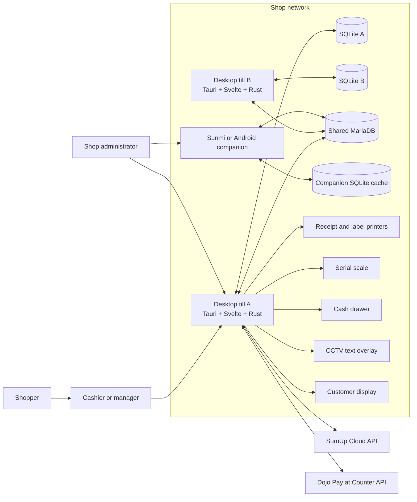

### 3.1 Actors

| Actor | Main responsibilities |
|---|---|
| Cashier | Scan products, manage cart quantities, take payment, hold/retrieve carts, and close an assigned shift. |
| Supervisor or manager | Approve restricted actions, perform refunds/voids, review orders, cash up, and run reports according to permissions. |
| Administrator | Configure shop data, staff, roles, devices, layouts, sync, backup, and integrations. |
| Shopper | Receives the customer display, receipt, refund, loyalty, and payment outcome. |
| Sunmi operator | Adds/edits catalogue data, changes prices in bulk, manages promotions, captures images, and prints labels. |

## 4. Deployment Modes

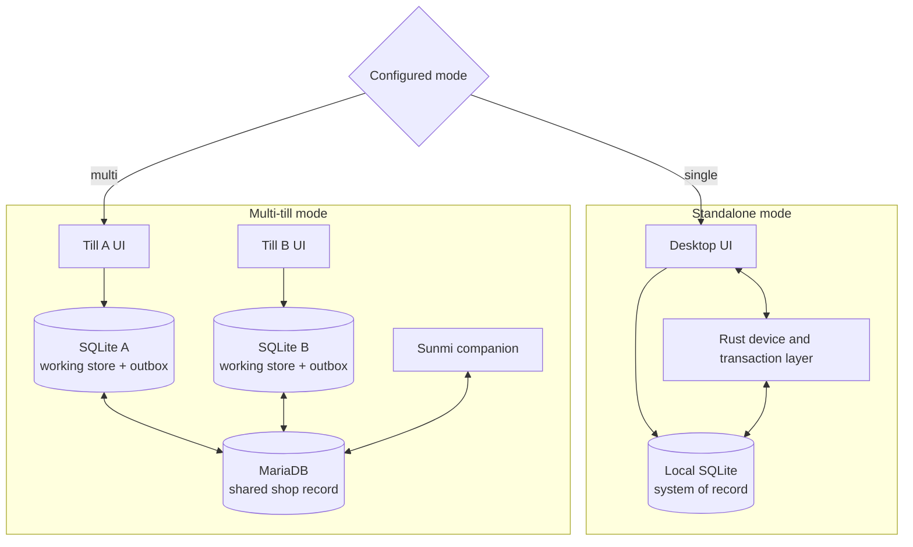

### 4.1 Standalone mode

- `pos.db` is the working database and the only business-data store.
- Reads and writes are local.
- Network-dependent shared-till coordination does not apply.
- Manual and automatic backups snapshot the local database.
- SumUp and Dojo still require internet access, but shared terminal leasing through MariaDB is unavailable.

### 4.2 Multi-till mode

- Every desktop till has its own `pos.db` and can continue ordinary sales while MariaDB is temporarily unavailable.
- MariaDB holds the shared shop state and server-authoritative timestamps.
- Local writes enter a durable outbox and are flushed asynchronously.
- Each till pulls changed tables using a MariaDB change cursor and per-table watermarks.
- Globally coordinated actions require MariaDB online.
- The Sunmi companion connects to the same MariaDB database directly.

### 4.3 Network topology

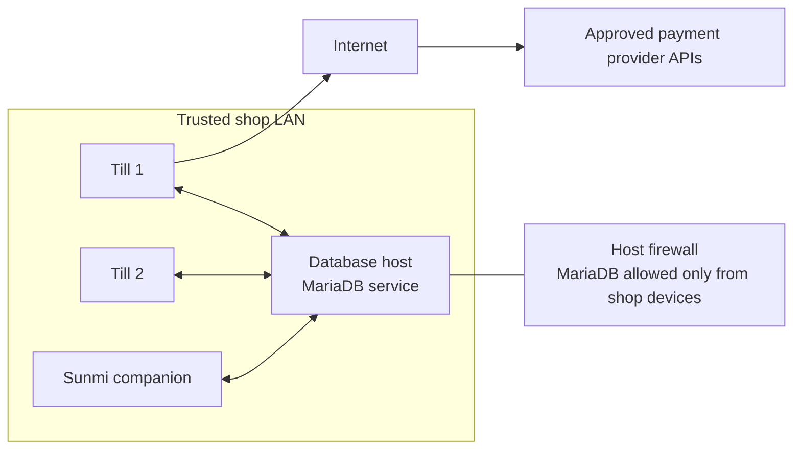

MariaDB should never be exposed openly to the internet. Tills use a dedicated database account with only `SELECT`, `INSERT`, `UPDATE`, `DELETE`, `CREATE`, `ALTER`, `INDEX`, and `REFERENCES` on the POS database.

## 5. Technology and Repository Structure

### 5.1 Technology stack

| Layer | Technology | Responsibility |
|---|---|---|
| Desktop shell | Tauri 2 | Windows/macOS application lifecycle, native commands, secondary windows, bundling, capabilities. |
| Desktop UI | SvelteKit, Svelte 5, TypeScript | Routes, stores, checkout UI, administration, reports, design tools, device settings. |
| Styling | Tailwind CSS 4 and route CSS | Responsive till UI, themes, fonts, tile and label design. |
| Native layer | Rust | Atomic commerce transactions, backup/restore, raw device I/O, payment HTTP clients, OS integration. |
| Local database | SQLite through Tauri SQL and `sqlx` | Offline working set, transaction history, settings, outbox, conflicts, FTS index. |
| Shared database | MariaDB/MySQL through Tauri SQL and `sqlx` | Multi-till shared state, change log, tombstones, presence, leases, global reporting. |
| Companion | Flutter/Dart | Android/Sunmi catalogue management, scanning, image capture, promotions, label printing. |
| Desktop web runtime | WebView2 on Windows | Renders the Svelte application; an offline WebView2 installer is bundled. |

### 5.2 Important source areas

| Path | Purpose |
|---|---|
| `src/routes/+layout.svelte` | Startup orchestration, database initialization, route hydration, session guard, sync lifecycle, automatic backup, customer display. |
| `src/routes/+page.svelte` | Main POS, scanning, cart, checkout, holds, refunds, shifts, printing, and physical-device actions. |
| `src/lib/stores/database.ts` | Unified single/multi database API, offline outbox, pull/flush orchestration, hydration, conflict handling. |
| `src/lib/stores/sqlite.ts` | SQLite schema, migrations, local queries, FTS, paging, settings, and local state. |
| `src/lib/stores/mysql.ts` | MariaDB schema, triggers, safe upserts, change log, reports, bootstrap, presence, and shared coordination. |
| `src/lib/stores/session.ts` | Employee session and permission helpers. |
| `src/lib/printers.ts` | Receipt/label rendering and ESC/POS, Star, ZPL, and TSPL transport framing. |
| `src/lib/scaleHardware.ts` | UI-side scale configuration and native command bridge. |
| `src/lib/cctvPos.ts` | Bounded, non-blocking CCTV text-overlay queue. |
| `src/lib/customerDisplay.ts` | Secondary-window creation and display event publishing. |
| `src/lib/discountEngine.ts` | Discount/promotion eligibility and calculation. |
| `src/lib/refunds.ts` | Full and partial refund calculations and validation. |
| `src-tauri/src/commerce.rs` | Atomic sale, refund, void, backup, restore, purge, and recovery operations. |
| `src-tauri/src/lib.rs` | Tauri commands, scale serial reading, network/serial printing, CCTV, drawer, and app wiring. |
| `src-tauri/src/sumup.rs` | SumUp Cloud API integration and local provider configuration. |
| `src-tauri/src/dojo.rs` | Dojo Pay at Counter integration and local provider configuration. |
| `../sunmi_companion/lib` | Flutter companion screens, MariaDB sync, local cache, scan, and label-print implementation. |

## 6. Desktop Runtime Architecture

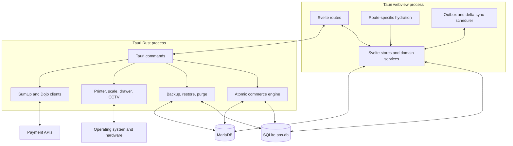

The Svelte and Rust layers deliberately overlap in database access. Routine CRUD and hydration use the TypeScript stores. Financially sensitive multi-record writes and physical I/O use native Rust commands so they can be performed as explicit database transactions or OS-level operations.

## 7. Application Startup

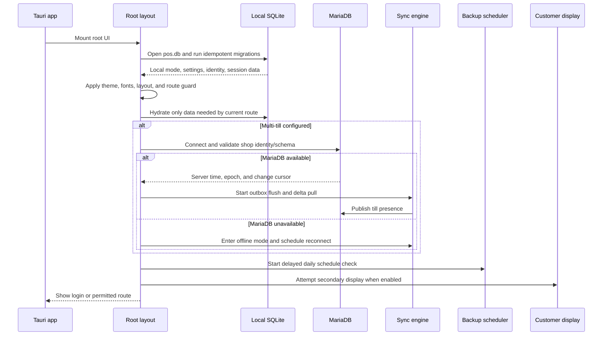

Startup and route navigation avoid loading the whole database. The root layout performs a light base hydration, and each page requests its own working set. The POS route loads products referenced by POS tiles, the goods menu, and scale configuration instead of every product and image.

## 8. User Interface and Route Map

### 8.1 Operational routes

| Route | Responsibility |
|---|---|
| `/` | Login, shift start, scanner input, product tiles, cart, discounts, payment, hold/retrieve, refunds, printing, and end-of-day entry points. |
| `/items` | Paged item management, indexed search, create/edit, product images, stock, barcode, scale, tax, and goods-menu assignment. |
| `/categories` | Category management. Category visibility is now determined by page/tile assignments, not a legacy `showOnPos` flag. |
| `/customers` | Customer details, loyalty balances, and history. |
| `/orders` | Paged order history, line/payment detail, printing, refunds, partial refunds, and void workflow. |
| `/shifts` | Till shifts, opening float, cash movements, cash-up, differences, and close reports. |
| `/reports` | Today-first sales reporting, till/system totals, payment breakdown, products, staff, trends, export, print, and report markers. |
| `/label-print` | Select products and print labels using the current till's local label-printer settings. |
| `/customer-display` | Lightweight secondary-window route for shopper-facing basket and payment state. |

### 8.2 Administration routes

| Route | Responsibility |
|---|---|
| `/admin` | Permission-aware administration menu. |
| `/employees` | Staff accounts and roles. |
| `/employees/permissions` | Role capability editor. |
| `/discounts` | Discounts, promotion groups, product membership, limits, and scheduling. |
| `/suppliers` | Supplier records and product associations. |
| `/stock-receiving` | Goods receipts, receipt lines, supplier costs, stock movements. |
| `/tax-rates` | Tax configuration. |
| `/audit` | Paged staff/system audit history. |
| `/sync` | Connection health, queue/conflict status, connected tills, schema checks, migration, and repair controls. |
| `/design` | Design Studio menu. |
| `/tiles` | POS pages and product/category/action tile assignment. |
| `/design/scale` | Scale-product tile layout. |
| `/about` | Product and support information. |

### 8.3 Settings routes

Settings are divided into themes, fonts, layout, printers, receipt design, labels, scale, barcode rules, customer display, sound/haptic feedback, integrations, SumUp, Dojo, and advanced database/backup maintenance. Hardware and provider pages write local-only settings where the physical till must remain independent.

## 9. Data Architecture

### 9.1 Data authority

| Data class | Standalone authority | Multi-till authority | Local behavior |
|---|---|---|---|
| Products, categories, taxes, layouts | SQLite | MariaDB converged shared state | Cached and editable offline, then safely upserted. |
| Customers and loyalty | SQLite | MariaDB converged shared state | Cached; sale loyalty changes are bundled. |
| Orders, lines, payments | SQLite | MariaDB shared history after outbox flush | Sale is first committed atomically to SQLite. |
| Stock and inventory logs | SQLite | MariaDB shared state/history | Stock movement is part of sale/refund/receipt transactions. |
| Employees, roles, permissions | SQLite | MariaDB shared state | Session remains local to the running app. |
| Till printer, scale, CCTV, feedback, terminal credentials | SQLite or provider JSON | Local till only | Never pulled from another till. |
| Outbox and sync conflicts | SQLite | Local till only | Durable recovery and operator intervention state. |
| Till presence and terminal leases | Not required | MariaDB only | Ephemeral coordination, excluded from normal business backup. |
| Companion cache and credentials | Companion SQLite/preferences | MariaDB is shared authority | Used for mobile responsiveness and offline product changes. |

### 9.2 Core commerce model

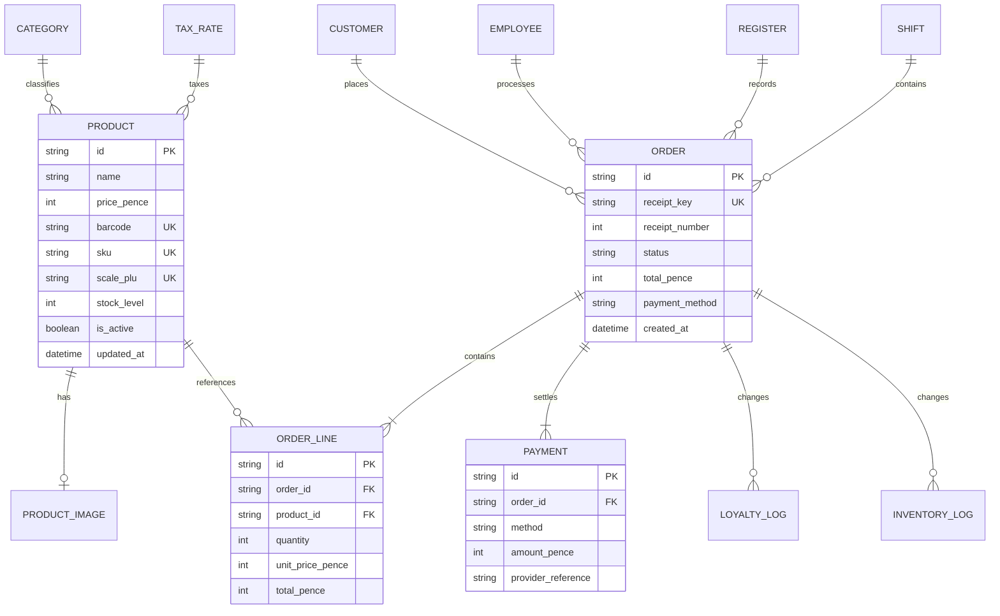

### 9.3 Catalogue, promotion, and layout model

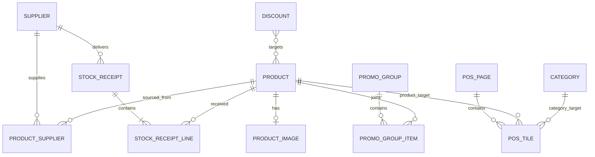

### 9.4 Staff, reporting, and synchronization model

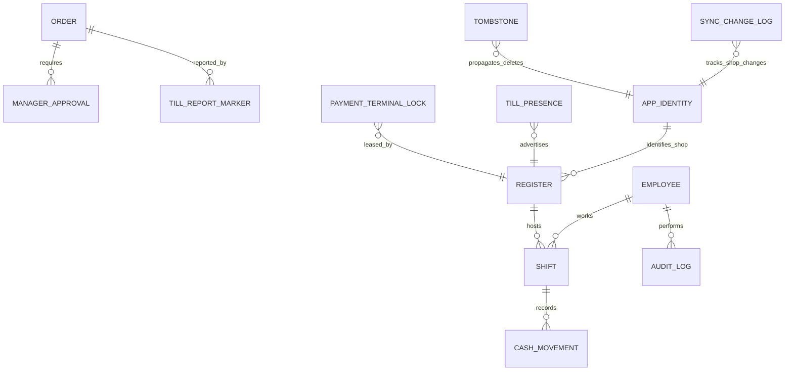

### 9.5 Table catalogue

| Table | Purpose | Location |
|---|---|---|
| `products` | Product master, identifiers, price/cost, stock, tax, scale and goods-menu properties. | SQLite and MariaDB |
| `product_images` | Product image payload separated from normal product hydration. | SQLite and MariaDB |
| `categories` | Product grouping. | SQLite and MariaDB |
| `pos_pages`, `pos_tiles` | Designed POS pages and tile assignments/order. | SQLite and MariaDB |
| `tax_rates` | Tax percentages and defaults. | SQLite and MariaDB |
| `customers` | Customer identity, contact, and loyalty balance. | SQLite and MariaDB |
| `orders`, `order_lines`, `payments` | Sales, holds, returns, voids, lines, and tender records. | SQLite and MariaDB |
| `employees`, `registers` | Staff and till identity records. | SQLite and MariaDB |
| `discounts`, `promo_groups`, `promo_group_items` | Discount rules and bundle/group membership. | SQLite and MariaDB |
| `suppliers`, `product_suppliers` | Supplier catalogue links and costs. | SQLite and MariaDB |
| `stock_receipts`, `stock_receipt_lines` | Goods-receiving documents. | SQLite and MariaDB |
| `inventory_logs` | Auditable stock movement history. | SQLite and MariaDB |
| `shifts`, `cash_movements` | Opening float, cash activity, cash-up, and closure. | SQLite and MariaDB |
| `loyalty_logs` | Earn/redeem/adjustment audit. | SQLite and MariaDB |
| `audit_logs`, `manager_approvals` | Security and privileged-action evidence. | SQLite and MariaDB |
| `daily_sales_summary`, `till_report_markers` | Reporting summaries and closure markers. | SQLite and MariaDB |
| `settings` | Shared shop options plus explicitly filtered local-till settings. | SQLite and MariaDB |
| `app_identity` | Stable shop ID plus the signed offline licence token and licence reference. | SQLite and MariaDB |
| `tombstones` | Deleted-row propagation. | SQLite and MariaDB |
| `_offline_queue` | Durable local write outbox. | SQLite only |
| `_sync_conflicts` | Quarantined non-retryable writes. | SQLite only |
| `payment_terminal_attempts` | Local managed-payment recovery journal. | SQLite only |
| `product_search_fts` | SQLite FTS5 item-search index. | SQLite only |
| `sync_change_log` | Trigger-fed sequence of changed shared tables. | MariaDB only |
| `till_presence` | Heartbeat and till-name presence data. | MariaDB only |
| `payment_terminal_locks` | Exclusive lease for a shared managed terminal. | MariaDB only |

### 9.6 Identifiers, money, and time

- Business records use stable string IDs generated by clients.
- Money is stored and calculated as integer pence. Formatting to GBP occurs only at the UI and print boundary.
- Product barcode, SKU, and scale PLU are unique when nonblank.
- MariaDB server UTC is the synchronization clock. Its triggers stamp `updatedAt` on shared inserts and updates.
- Per-table pull watermarks overlap by five seconds to avoid missing rows on timestamp boundaries.
- Each till receives a numeric till sequence. Receipt numbers use non-overlapping blocks of 1,000,000 per till; changing a till display name does not change its sequence.
- In multi-till mode, an untouched generic display name follows that sequence (`Till 1`, `Till 2`, and so on). A name saved by an operator is device-local and is never overwritten automatically. Standalone mode does not claim a shared sequence and keeps its local name.
- `receiptKey` is unique and is used with the order ID to make remote sale replay idempotent.

## 10. Synchronization Design

### 10.1 Local-first write and delta pull

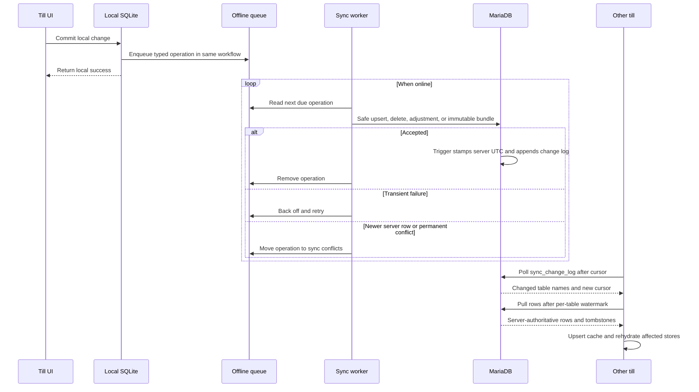

### 10.2 Outbox operation types

| Operation | Use |
|---|---|
| `upsert` | Normal shared-row insert/update. Offline replay refuses to overwrite a newer MariaDB row. |
| `remove` | Delete row and allow tombstone propagation. |
| `adjustStock` | Atomic relative stock movement. |
| `saleBundle` | Immutable order, lines, payment, stock, loyalty, audit, and optional original-order status. |
| `promotionBundle` | Promotion and membership write requiring grouped handling. |
| `promotionDelete` | Coordinated promotion removal. |
| `limitGoodsMenuItems` | Enforce the shared goods-menu item limit. |

### 10.3 Scheduling and bounds

| Activity | Current behavior |
|---|---|
| Change-log polling | Approximately every 5 seconds while connected. |
| Till presence | Heartbeat every 15 seconds; a till is considered online within a 45-second window. |
| Fast fallback sync | Approximately every 60 seconds. |
| Full fallback sync | Approximately every 5 minutes. |
| Offline reconnect check | Approximately every 60 seconds. |
| Pull page size | 500 rows. |
| Retry backoff | Starts around 2 seconds and caps around 60 seconds. |
| Normal operation attempts | Up to 3 before conflict quarantine when non-transient. |
| Sale bundle attempts | Up to 5 because the remote write is idempotent. |
| Change-log retention | Pruned with a default retained window of about 200,000 records. |

### 10.4 Conflict rules

- MariaDB is authoritative for synchronization time.
- An offline row with an older `updatedAt` cannot overwrite a newer server row.
- Duplicate product identifiers and other permanent uniqueness violations become visible sync conflicts.
- Promotion membership duplicates created concurrently are collapsed to the server row during delta sync.
- A sale bundle can be replayed safely only when its existing MariaDB order ID and receipt key identify the same sale.
- A failed exact financial reversal is rolled back or quarantined; it is not silently approximated.
- Conflicts require operator review from the sync page. They are not discarded automatically.

This is eventual consistency, not general multi-master conflict merging. Simultaneous edits to the same product can require intervention.

### 10.5 Deletion, restore, and shop identity

- MariaDB delete triggers create tombstones so other tills can remove stale cached rows.
- `app_identity.shopId` prevents a till from merging a different shop's MariaDB into its local cache.
- Initial local-to-multi bootstrap is allowed only when the server is empty and is marked complete.
- Pull safety checks reject an obviously incomplete server dataset during setup/migration.
- A shop-wide replacement increments `server_data_epoch`. Other tills then clear stale shared cache and repull.
- A transaction purge writes `transaction_purge_at`; every till that observes the marker clears its local transaction history.

### 10.6 Offline behavior matrix

| Operation | MariaDB offline in multi mode | Reason |
|---|---|---|
| Scan, cart, ordinary sale | Allowed | Sale commits locally and queues an idempotent bundle. |
| Product/customer edit | Allowed | Safe upsert is queued, subject to later conflict checks. |
| Shared held-cart retrieval | Blocked | Requires an atomic global claim. |
| Managed terminal payment | Blocked or unavailable | Requires provider network and a shared terminal lease. |
| Full/partial refund or void | Blocked | Must validate globally remaining refundable amounts and financial state. |
| Live system end-of-day | Blocked | Requires complete shared history and no pending/conflicting transactions. |
| Local receipt reprint | Allowed | Uses locally stored order data and till-local printer configuration. |

## 11. Sales and Checkout

### 11.1 Product acquisition

Products can enter the cart from a hardware barcode scanner acting as keyboard input, POS product tiles, the goods menu, scale barcode decoding, or a one-shot serial scale read. Main-POS scanning is barcode-focused; administrative item search uses the indexed item page.

The POS does not hydrate every catalogue image. It loads active products referenced by the currently designed POS pages, goods menu, or scale configuration, and attaches only their corresponding image rows.

### 11.2 Checkout sequence

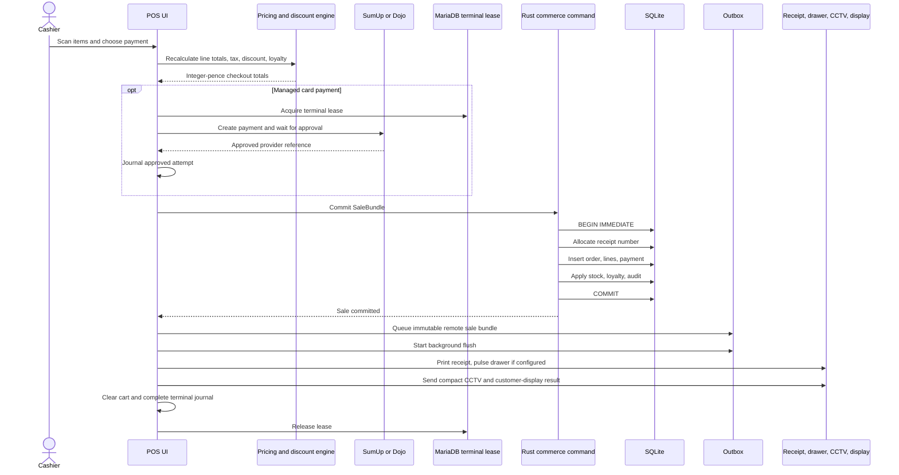

### 11.3 Sale invariants

- Empty carts and invalid totals cannot complete.
- The order, lines, payment, stock, loyalty, audit, and original-order status are one local database transaction.
- The remote sale outbox row is currently inserted immediately after the native sale transaction returns, not inside that transaction. A process or power failure in that narrow interval can leave a locally completed sale without its MariaDB queue row; startup reconciliation or transactional outbox insertion should close this gap.
- Stock changes use relative atomic updates rather than replacing a stale absolute value.
- Loyalty cannot be redeemed below zero.
- Training mode exercises the UI without persisting a sale.
- A managed card approval is journaled before local sale commit so a crash cannot invite a second charge.
- Printing happens only after database commit. A printer failure does not reverse a valid sale.

### 11.4 Payment methods

The checkout supports cash, manual card, split tender, loyalty redemption, and managed SumUp/Dojo payment when configured. Payment rows preserve the method, amount, and provider reference needed for reporting and refunds.

## 12. Managed Payment Terminals

### 12.1 Provider architecture

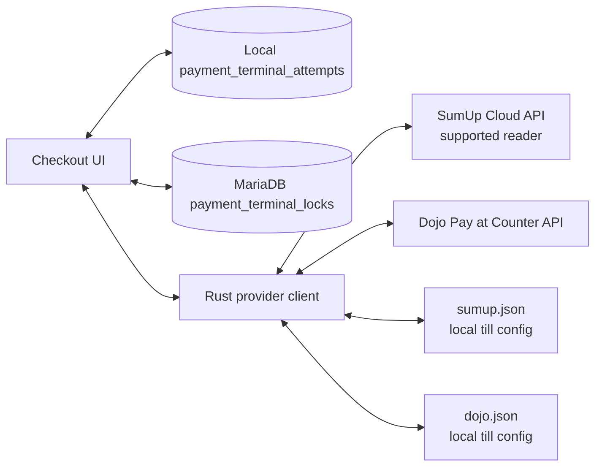

### 12.2 Attempt state machine

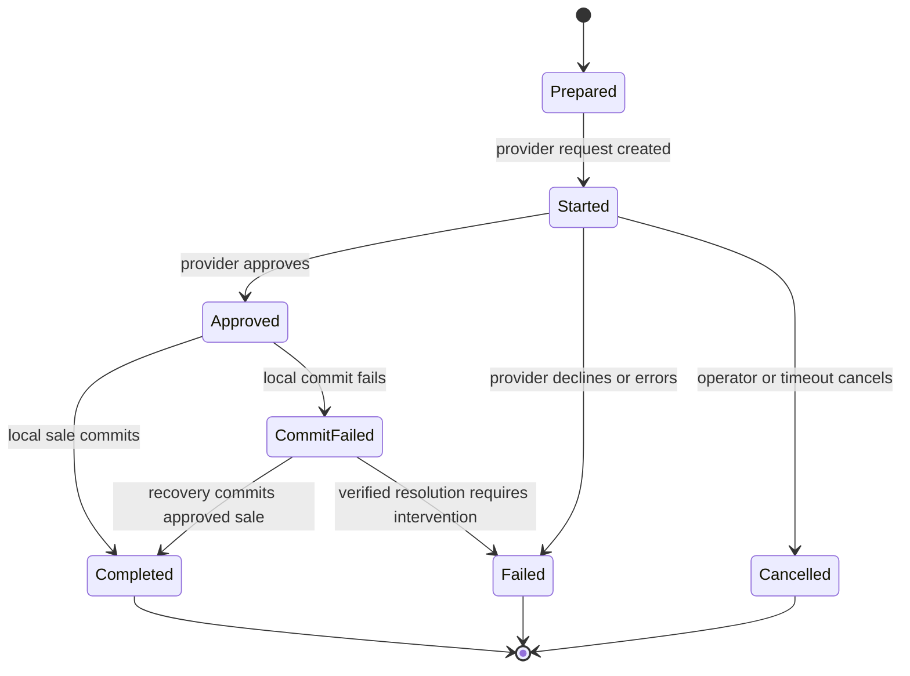

The recovery journal is inspected during startup and POS entry. An approved provider transaction with a failed local commit is recovered rather than charged again. Managed refunds compare local intent with provider refund state to reduce double-refund risk.

### 12.3 Till-local configuration

SumUp and Dojo credentials, reader/terminal selection, and provider behavior are local to the till. They are not synchronized through the settings table. Provider configuration files are atomically written in the platform application configuration directory. Unix permissions are restricted to `0600`; the values are not encrypted at rest and should be protected by the operating-system user account.

## 13. Refunds, Partial Refunds, and Voids

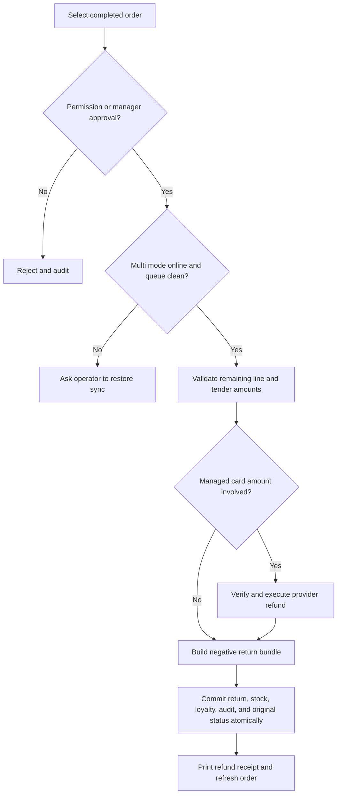

- Full and partial refunds allocate values proportionally and preserve snapshots of original sale information.
- Remaining refundable quantity and amount are validated against all earlier returns.
- Cash and card allocations cannot exceed their original tender balances.
- Stock and loyalty consequences are reversed in the same transaction.
- Void rules and closed-report-period rules are checked before mutation.
- Multi-till refunds and voids require shared history to be current and therefore do not run offline.

## 14. Held Carts

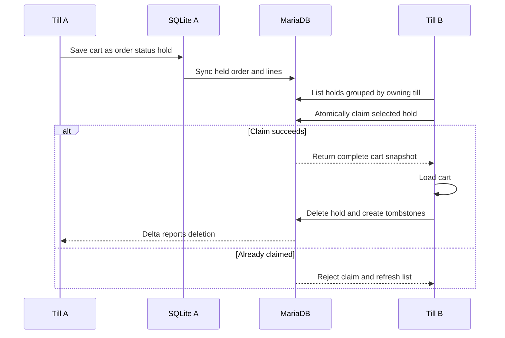

Holds are shared business data. The retrieve dialog defaults to the current till and allows a deliberate switch to another till. A MariaDB atomic claim prevents two tills from retrieving the same cart.

## 15. Promotions, Discounts, and Pricing

- Discounts and promotion groups are shared between tills.
- Promotion membership is modeled separately so bundles and groups do not duplicate full product rows.
- Pricing and totals are recalculated from integer-pence inputs before payment.
- Restricted manual discount or price-override actions are controlled by role permissions and manager approval.
- The Sunmi companion can perform bulk price changes and promotion management against MariaDB.
- A product edit received from Sunmi appears on desktops after the change cursor pulls the changed product table.
- Concurrent offline edits to the same product are not merged field by field; the older replay becomes a conflict.

## 16. Inventory and Receiving

Stock changes originate from sales, refunds, voids, stock receiving, and explicit adjustments. Every significant movement records an inventory log where the workflow supplies one. Products can disable stock tracking. Goods receipts group supplier, receipt lines, quantities, and costs, then apply stock changes transactionally.

The scale supports two separate concepts:

1. A hardware serial scale can provide a one-shot weight for a selected weighted product.
2. A scale barcode can encode a configured PLU plus weight or price and be decoded by the barcode-rules engine.

## 17. Hardware and Peripheral Design

### 17.1 Device boundary

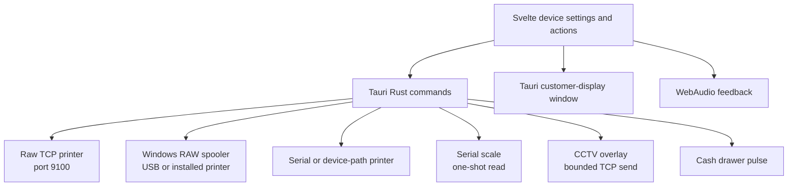

### 17.2 Receipt and label printing

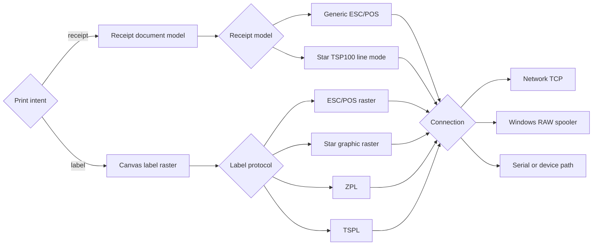

- Receipt settings include paper width, shop text, line formatting, GBP/code-page handling, barcode, cut, and optional drawer pulse.
- Label settings include physical width/height, name/price/barcode/date visibility and sizing, character limit, margins, offsets, barcode dimensions, and protocol.
- The print date means the label's printing date only, not product expiry or best-before.
- Direct label protocols are sent only over direct/raw-capable connections. System/driver printing is prevented from receiving raw label bytes that would print as gibberish.
- A successful label print clears the current label selection.
- The cash drawer is a separate action/setting even when it shares the receipt-printer transport.
- Star uses either Star line commands for receipts or framed Star graphic raster for labels; the operator must choose the protocol that matches the printer and media.

### 17.3 Scale

- Native code enumerates serial ports and performs a bounded one-shot read when requested.
- Default settings use 9600 baud and a bounded read timeout, with parsing for common grams/kilograms output.
- Modes include automatic parsing and print/listen variants required by different indicators.
- Continuous high-frequency polling is avoided so an idle scale does not consume a CPU core.
- Scale barcode rules validate prefix, product-code slice, value slice, interpretation as weight or price, and optional check digit.

### 17.4 CCTV text overlay

- Item events send a compact single line containing product, quantity, price, and total within the configured column limit.
- Payment completion sends a compact receipt summary.
- Output can be Latin-1 or UTF-8 according to the camera overlay device.
- Sends use a short timeout, a queue capped at five messages, and an offline cooldown. An unavailable camera therefore cannot repeatedly block the checkout UI.
- GBP output depends on the overlay device's supported encoding; textual `GBP` remains the safe fallback.

### 17.5 Customer display

- A second Tauri webview window is opened on an available secondary monitor and can be fullscreen.
- The main POS publishes cart, payment, and completion events to the display window.
- The display route intentionally does not start the full sync engine or hydrate administration data.
- Startup retries are bounded so a missing second monitor does not create an endless busy loop.

### 17.6 Sound and haptics

- Button, item, scanner, sale, and haptic feedback are independently configurable per till.
- Sounds are synthesized through WebAudio instead of shipping large audio assets.
- The audio context is suspended after a short idle period to reduce background CPU use.
- Scanner feedback can be turned off independently, preventing audible keyboard-like feedback when a hardware scanner emits barcode digits.

## 18. Staff, Sessions, and Permissions

### 18.1 Roles

The built-in role model includes administrator, manager, supervisor, and cashier. Administrators retain all capabilities. Other roles are composed from explicit permission keys such as opening items, discounts, reports, settings, employees, Design Studio, sync, audit, stock, price override, refunds, manual discounts, and end-of-day actions.

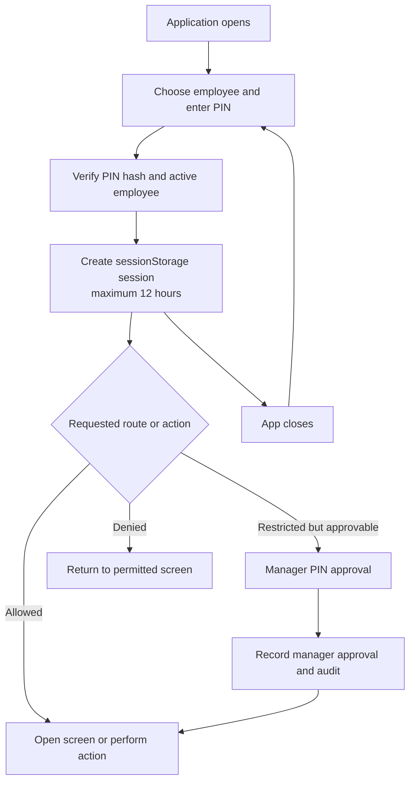

### 18.2 Session behavior

- Employee sessions live in browser `sessionStorage` and expire after at most 12 hours.
- A page reload can retain the session, while closing and reopening the application requires login again.
- PINs use a SHA-256 digest with a fixed application prefix. Legacy plain PINs are accepted once and migrated.
- Sensitive workflows also check explicit permissions and can require manager approval.

### 18.3 Security boundary limitations

The current session and route checks are primarily in the frontend. They are useful application controls but are not a complete hostile-client security boundary. The generic SQL capability and several native commands are available to the allowed Tauri windows without a cryptographically bound employee identity passed into every command.

## 19. Reports, Shifts, and End of Day

- Reports default to today rather than the current month.
- Views include total sales, tender breakdown, tax, discounts, refunds, top products, daily trend, employee totals, till totals, and system totals.
- Orders, shifts, and audit history are paged rather than rendered in one unbounded list.
- Reports can print and export CSV.
- Till report markers track local closure state; system end-of-day requires complete MariaDB state.
- Shift cash-up compares opening float, expected cash/card, actual counted amounts, and differences.
- A cashier can be allowed to close their shift/end day without receiving general report-page access; these are separate capabilities.
- GBP is represented internally as pence and explicitly formatted at the report/receipt boundary to avoid broken encoding symbols.

In multi-till mode, a live system close is blocked when MariaDB is offline, transaction writes are pending, or unresolved synchronization conflicts could make the totals incomplete.

## 20. Backup, Restore, and Data Purge

### 20.1 Backup types

| Backup | Contents | Retention and destination |
|---|---|---|
| Manual full backup | Complete local SQLite snapshot, including transaction history, settings, identity, and current queue state. | Operator-selected destination or configured backup directory. |
| Automatic shop-setup backup | Products, customers, staff, configuration, layouts, promotions, stock state, and other setup data; transaction history and source register identities are sanitized. | Runs after configured local time, one per day, retaining today and yesterday. |
| Pre-restore safety backup | Current local database immediately before replacement. | Created automatically as part of restore safety. |

The configured base folder receives `LBj POS Backups/<TillName>-<TillId8>/` so two tills do not overwrite one another. A cloud-synchronized folder such as Google Drive can be selected, but the POS writes ordinary local files; the cloud provider performs its own synchronization.

### 20.2 Restore workflow

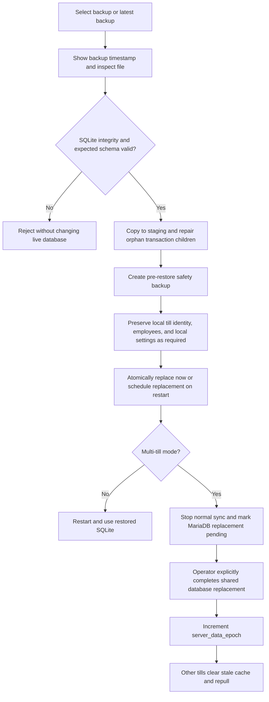

A restore never adopts register identities from its source backup. The target SQLite database is rebuilt with only that machine's preserved `till_id` and display name. In multi-till mode, shared replacement preserves MariaDB's existing register rows and upserts only the restoring machine, so restoring one till cannot duplicate or remove another till.

A local restore does not silently overwrite MariaDB. In multi-till mode it enters a protected pending state until the operator explicitly confirms the shared replacement. This prevents normal sync from immediately undoing the restored state or merging two unrelated snapshots.

### 20.3 Delete history

The advanced delete-history operation removes sales-related history while preserving the live shop setup, including products, current stock, customers, loyalty balances, employees, and settings. In multi-till mode it deletes centrally and writes a purge marker. Other tills observe the marker and clear their local transaction history. After success, the UI resets its transaction stores and returns professionally to the main POS screen.

Ephemeral presence and terminal-lock rows are not treated as restorable business records.

## 21. Sunmi Companion

### 21.1 Purpose and topology

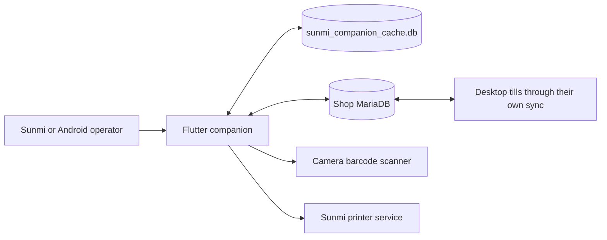

### 21.2 Companion capabilities

- Search, scan, add, and edit products.
- Capture and synchronize product images in `product_images`.
- Manage scale products without incorrectly forcing goods-menu visibility.
- Perform bulk price changes by scanning a group and assigning one price.
- Manage discounts and promotion groups.
- Configure a companion-local label design and print a test label.
- Print raster labels through the Sunmi printer service, including optional print date and feed control.
- Cache catalogue data locally for responsive browsing and queue ordinary product edits while offline.

### 21.3 Companion synchronization

- The companion polls roughly every five seconds and throttles repeated sync starts.
- It uses a change cursor plus per-table watermarks with a five-second overlap.
- Products, product images, categories, tax rates, and selected settings are pulled into local SQLite.
- Product edits are written locally, queued, and replayed to MariaDB with server-authoritative timestamps.
- Promotion workflows currently use direct MariaDB transactions and therefore require connectivity.
- Desktop tills receive successful companion edits through their normal MariaDB change-log pull.

### 21.4 Companion limitations

- MariaDB credentials are stored in Android preferences rather than an encrypted device keystore.
- No employee login or permission boundary was observed; the device should be treated as an administrator tool.
- No equivalent desktop `shopId` mismatch guard was observed, so database configuration must be verified carefully before syncing.
- Its local category cache still contains a legacy `showOnPos` compatibility field even though desktop category visibility no longer uses that column.
- The companion connects directly to MariaDB and may need schema-alter privileges for first-run image table/trigger setup.
- It does not process sales, orders, shifts, refunds, or card payments.

## 22. Performance and Resilience

### 22.1 Implemented controls

| Area | Control |
|---|---|
| SQLite | WAL mode, foreign keys, a 10-second busy timeout, targeted indexes, atomic transactions. |
| Item search | FTS5 prefix search, result caps, paging, and a bounded contains fallback after sufficient input. |
| Item list | Default page size 50 with a maximum of 100 rather than loading the full catalogue. |
| POS catalogue | Loads only products referenced by tiles, goods menu, or scale setup. |
| Product images | Stored in a separate table and attached only when requested. |
| History | Orders, shifts, and audit pages are paged. |
| Navigation | Route-specific hydration and cleanup reduce the data retained after leaving administration pages. |
| Sync | Change-log table selection, paged pulls, backoff, and rehydrate-only-on-change behavior. |
| CCTV | Small queue, short timeout, and offline cooldown. |
| Scale | One-shot reads instead of perpetual serial processing. |
| Audio | WebAudio context sleeps after idle. |
| Customer display | Lightweight route with no duplicate full sync engine. |

### 22.2 Expected resource profile

Tauri still uses a native process plus one or more WebView2 processes on Windows. Several WebView2 tasks and memory around a few hundred megabytes can be normal. On older Intel Celeron J1900-class hardware with 4 GB RAM, webview rendering, image decoding, antivirus, MariaDB, and background Windows services can make intermittent CPU spikes visible. The application optimizations reduce avoidable work but cannot remove the WebView runtime cost.

### 22.3 Remaining performance risks

- The main POS route is a large component with many workflows and reactive dependencies; further decomposition and profiling would reduce regression risk.
- Base64/raster product images still consume database, decode, and GPU memory. Images should be compressed and bounded before storage.
- A full fallback sync can still hydrate many changed rows after a long offline period.
- Direct database clients perform schema checks/migrations and synchronization work that a central backend would otherwise consolidate.
- Browser development preview uses seeded/in-memory behavior for parts of the app and is not a substitute for Tauri/SQLite performance testing.
- Real acceptance testing should include the weakest supported till, two tills, the actual MariaDB host, printers, scale, CCTV offline behavior, and customer display.

## 23. Security Design and Risk Register

### 23.1 Current protections

- Employee login, expiry, roles, explicit capabilities, manager approval, and audit logs.
- Dedicated MariaDB application account and recommended LAN firewall restriction.
- Shop identity check before desktop synchronization.
- Atomic payment journal and shared terminal lease.
- Backup integrity validation and staged replacement.
- Safe offline upserts and visible conflict quarantine.
- Provider configuration written atomically with restrictive Unix file permissions.

### 23.2 Current risks

| Priority | Risk | Recommended direction |
|---|---|---|
| High | MariaDB is reached directly by every client, increasing credential and schema exposure. | Introduce a shop gateway/service before internet or multi-site deployment. |
| High | Local sale commit and sale-outbox insertion are two separate SQLite transactions. | Insert the outbox payload inside the native sale transaction, or reconcile completed local sales against MariaDB on startup. |
| High | MariaDB password is stored in local SQLite settings; companion credentials use preferences. | Move secrets to Windows Credential Manager, macOS Keychain, and Android Keystore. |
| High | Frontend permissions are not cryptographically bound to every native/SQL command. | Add native authorization tokens and command-level permission checks; narrow SQL capability. |
| High | Tauri CSP is currently disabled. | Define a restrictive CSP and verify provider/customer-display requirements. |
| Medium | PIN hashing uses unsalted SHA-256 and supports legacy plain values during migration. | Move to Argon2id or platform credential verification with per-user salts. |
| Medium | Companion has no observed shop-identity mismatch guard or staff authentication. | Add shop identity validation, device enrollment, and an admin session. |
| Medium | Provider secret JSON is permission-protected but not encrypted. | Use platform secret stores and rotate exposed credentials. |
| Medium | Database clients require schema-changing permissions. | Separate migration/setup credentials from runtime credentials. |
| Low | Presence and locks depend on client clocks/timeouts around network pauses. | Continue using server time and add lease diagnostics/administrative expiry tools. |

This design is suitable for a trusted shop LAN. It should not be treated as a zero-trust or internet-facing architecture without the listed hardening.

## 24. Licensing Readiness

The desktop app now has a serverless manual licensing foundation. Settings > Shop Licence creates an `LBJREQ1` request from the stable shop identity. The private issuer tool converts that request into an Ed25519-signed `LBJ1` entitlement containing the shop ID, customer, issue date, expiry date, till allowance, and enabled features. Rust verifies the signature, shop binding, expiry, and active-till allowance before storing the token in `app_identity`.

The public verification key is compiled into the application. The private signing key is kept outside the repository and must never be shipped to a till. In multi-till mode, the verified token uses the shared `app_identity` row and synchronizes through MariaDB. A standalone till stores it only in local SQLite. A till rename does not change the shop ID or invalidate the licence.

Current builds intentionally use **setup mode**: status and activation are functional, but an absent or expired licence does not block sales. Commercial enforcement is compile-time opt-in through `LBJ_LICENSE_ENFORCEMENT=enforce`; native sale and online reversal entry points then reject unlicensed, expired, wrong-shop, or over-limit use. Existing queued sales remain syncable so enforcement cannot strand transactions already accepted offline.

This offline design does not provide immediate revocation, automatic billing, remote device removal, or reliable clock-tamper protection. A future vendor service can retain the signed local entitlement while adding renewal, revocation, a bounded offline grace period, and activation history. Operational commands are documented in `docs/MANUAL_LICENSING.md`.

## 25. Build, Packaging, and Installation

### 25.1 Desktop build

```text
npm install
npm run check
npm run tauri dev
npm run tauri build
```

SvelteKit is built as a static SPA with `ssr` disabled. Tauri packages the frontend and Rust binary. Windows bundles the configured offline WebView2 installer with a minimum runtime version of `125.0.2535.41`. The Windows installer can include the MariaDB host setup hook for the machine chosen to host the shared database.

CI workflows build Windows and arm64 macOS release artifacts. There is currently no configured automatic-update endpoint in the Tauri configuration.

### 25.2 Companion build

```text
cd ../sunmi_companion
flutter pub get
flutter test
flutter build apk
```

The Android manifest requires internet and camera access and enables hardware acceleration. Sunmi printing requires a compatible Sunmi device/service; ordinary Android phones can still exercise catalogue, camera, and form workflows.

### 25.3 Data locations

| Artifact | Location rule |
|---|---|
| Desktop SQLite | Tauri application-data directory as `pos.db`. |
| Desktop payment configs | Tauri application-configuration directory as `sumup.json` and `dojo.json`. |
| Default desktop backups | Application-data backup directory. |
| Custom backups | Selected local/cloud-synchronized base plus the till-specific subfolder. |
| Companion SQLite | Android application documents directory as `sunmi_companion_cache.db`. |
| MariaDB | Database host's configured MariaDB data directory, managed by MariaDB rather than the app. |

Uninstalling/reinstalling the desktop executable can preserve data when the platform application-data directory is retained. Operators must still take a verified backup before reinstalling or changing database mode.

## 26. Testing and Verification

### 26.1 Existing automated coverage

- Rust commerce tests cover core sale/refund transaction rules.
- Native tests cover scale parsing, CCTV formatting, and payment-provider helpers.
- SumUp and Dojo modules include focused unit tests for provider data and state behavior.
- Flutter tests cover product creation, bulk pricing, and label image generation.
- Tauri release workflows verify that platform bundles compile.

There is no broad TypeScript unit-test suite or complete automated end-to-end hardware suite at present.

### 26.2 Required release test matrix

| Test area | Minimum release verification |
|---|---|
| Standalone | Install, first-run schema, login, sale, receipt, refund, backup, restore, restart. |
| Multi-till | Two tills, offline sale, reconnect, conflict, deletion, hold claim, purge marker, server epoch replacement. |
| Payments | Approval, decline, cancel, timeout, approved/local-commit-failure recovery, refund, shared terminal contention. |
| Printing | Generic ESC/POS and Star receipt, cut, drawer on/off, label protocol per supported model, long names, GBP. |
| Scale | Supported serial output, timeout, malformed data, one-shot CPU behavior, scale barcode rules. |
| Reports | Cash/card/split/refund totals, till totals, system totals, report close, GBP output, CSV, print. |
| Security | Every role route/action, manager approval, session expiry, app restart login, disabled employee. |
| Performance | Weakest supported POS, 200+ product images, long order history, admin navigation, idle CPU, CCTV offline. |
| Companion | Product/image/price propagation, offline queue, promotion network failure, keyboard behavior, Sunmi label feed. |

## 27. Operations Runbook

### 27.1 Normal shop startup

1. Start the MariaDB host before multi-till clients where practical.
2. Open each till and confirm its own till name and ID.
3. Check the sync page for queue conflicts and connected-till presence.
4. Confirm the correct local printer, drawer, scale, CCTV, and terminal settings on each till.
5. Start the employee shift and verify opening float.

### 27.2 MariaDB outage

1. Continue ordinary cash/manual sales locally if appropriate.
2. Do not attempt global refunds, shared hold retrieval, or system end-of-day.
3. Restore the database/network connection.
4. Wait for the queue to flush and delta pull to complete.
5. Resolve any visible conflicts before financial closing.

### 27.3 Sync conflict

1. Open the sync page and inspect the affected table and record ID.
2. Compare the local intended edit with the current MariaDB record.
3. Choose the valid business value and reapply it from one authoritative client.
4. Confirm the conflict is cleared and the change appears on the other till.

### 27.4 Backup discipline

1. Configure a writable destination and daily setup-backup time.
2. Verify that today and yesterday are present in the till-specific folder.
3. Create a manual full backup before migration, reinstall, schema repair, or destructive maintenance.
4. Periodically restore a copy on a non-production machine; an untested backup is not a recovery plan.

## 28. Architectural Decisions

| Decision | Rationale | Consequence |
|---|---|---|
| Local-first desktop sales | Shop checkout must survive a temporary LAN/database outage. | Synchronization and conflict recovery are first-class system concerns. |
| MariaDB shared store without backend | Simple shop-LAN deployment and existing direct SQL implementation. | Credentials and schema are exposed to clients; internet-scale security is limited. |
| Integer-pence commerce | Deterministic financial arithmetic without floating-point drift. | Formatting/conversion must happen at every external boundary. |
| Immutable sale bundle replay | Prevent partial remote sales and allow safe retry. | Sale payload and idempotency keys must remain stable. |
| Separate product image table | Keep ordinary product lists and sync payloads lightweight. | Image lifecycle and hydration need separate handling. |
| Till-local hardware/provider settings | Different tills can have different physical devices and credentials. | Backups/restores must preserve the target till's local identity and configuration deliberately. |
| Tombstone deletion propagation | A missing row alone cannot tell an offline till to delete its cache. | Tombstones require retention and cleanup policy. |
| Native Rust for critical writes/I/O | Explicit transactions and reliable OS/hardware access. | Business logic spans TypeScript and Rust and requires cross-layer tests. |

## 29. Recommended Roadmap

### Phase 1: Shop hardening

- Complete a two-till hardware acceptance test on the weakest supported Windows POS.
- Add command-level native authorization and narrow Tauri SQL capabilities.
- Enable a restrictive CSP.
- Move database and provider secrets into platform credential stores.
- Add automated multi-till sync tests, including epoch restore and transaction purge.
- Make sale commit plus outbox insertion one native SQLite transaction and add crash-recovery reconciliation tests.
- Add structured local diagnostic logging with bounded retention and a support export.

### Phase 2: Maintainability and performance

- Split the main POS route into isolated cart, scanner, payment, hold, and device controllers.
- Add TypeScript tests for pricing, discounts, permissions, hydration, and sync state transitions.
- Add image ingest limits, compression metrics, and cache eviction/thumbnail strategy.
- Add repeatable performance benchmarks for item search, admin enter/leave, idle CPU, and 10,000-order history.
- Remove the Sunmi legacy category field and add shop-identity validation.

### Phase 3: Commercial platform

- Introduce a local shop gateway or vendor backend to remove direct database credentials from general clients.
- Add hosted renewal, revocation, device recovery, and subscription management around the signed offline licence foundation.
- Add a signed auto-update channel with staged rollout and rollback.
- Define a provider adapter interface before adding more payment-terminal companies.
- Define a versioned printer-driver/provider extension boundary; do not load unsigned arbitrary runtime code.
- Add encrypted off-site backup and tested disaster recovery.

## 30. Final System Guarantees

The implementation currently provides these practical guarantees when operated within a trusted shop LAN:

- A normal desktop sale is atomic in local SQLite.
- Once its outbox row exists, a queued sale can be retried against MariaDB without creating a different duplicate sale.
- Offline catalogue edits cannot silently overwrite a newer server edit.
- Deleted shared rows can propagate through tombstones.
- Two tills cannot successfully claim the same held cart.
- A shared managed terminal can be leased by only one till at a time when MariaDB is online.
- An approved managed payment is journaled for crash recovery before local completion.
- Shop-wide restore and history purge have markers that make other tills discard stale local data.
- Hardware and terminal configuration remains local to the physical till.
- Reports explicitly block global closing when shared data may be incomplete.

These guarantees depend on MariaDB integrity, correct shop identity, protected device/database credentials, successful operator conflict handling, and regular tested backups. The security and licensing limitations in this document should be addressed before exposing the system beyond a trusted shop environment or distributing it as a broadly managed commercial product.
